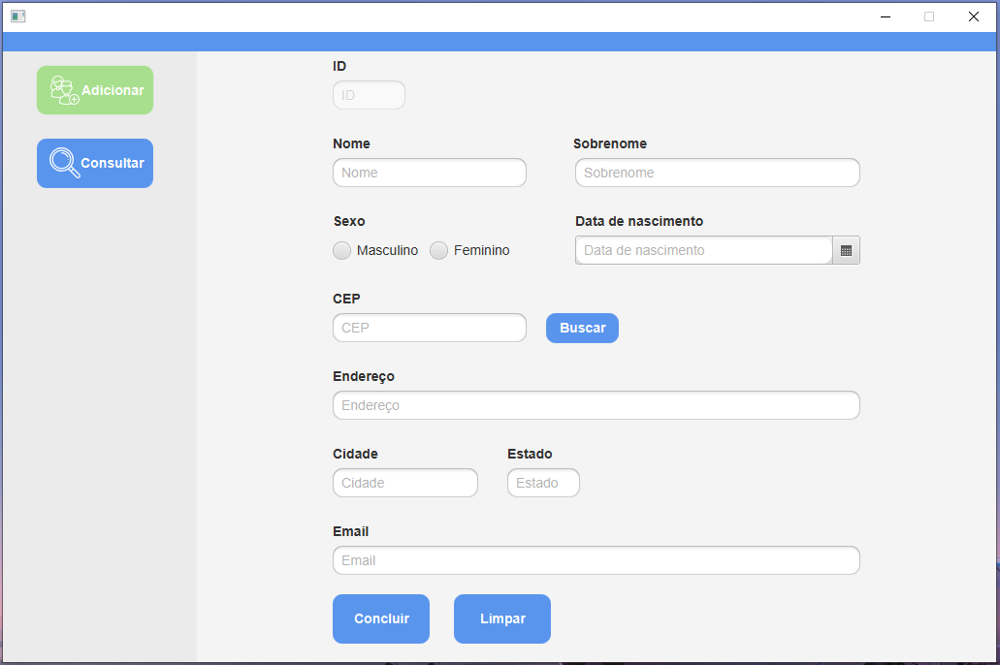
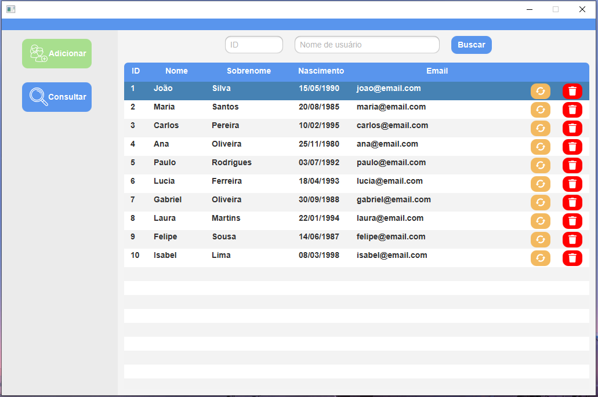

## Descrição

Esse projeto é uma implementação simples de um sistema CRUD para manipulação de banco de dados.
A ideia desse pequeno projeto é colocar em prática os conhecimentos recém-adquiridos sobre 
Spring Boot, Hibernate e JavaFX.

## Tecnologias

* Spring Boot
* Hibernate
* JavaFX
* MySQL
* Java
* CSS

## Funções

Apenas as funções necessárias para um sistema CRUD:

1. **Criação** de amostras
2. **Consulta** de amostras
3. **Atualização** de amostras
4. **Remoção** de amostras

Ainda não há verificadores nos campos do formulário. Sim, você pode inserir um texto na data gerando
uma _exception_.

São apenas duas telas:

1. A primeira é a tela onde você realizará as operações de **inserção** e **atualização** de amostras

2. A segunda tela permite ao usuário a **consulta** ao banco de dados, a **remoção** de amostras e a seleção
de determinado cliente para **atualização**

## Conclusão

À medida que aprender novas tecnologias, tentarei incorporá-las ao sistema. Não só isso, mas pretendo
adicionar novas funções, refatorar o código e inserir os devidos validadores.

## Se você quiser testar...

Bom, é um aplicativo bem simples, mas se você quiser testar basta seguir os seguintes passos:

1. Baixar o projeto e abrir com alguma IDE (Eu usei IntelliJ)
2. Instalar e configurar MySQL em sua máquina
3. Executar o seguinte _script_ SQL com usuário _root_: [start-script.sql](readme/start-script.sql)
4. Executar a aplicação via classe _CrudApplication_

